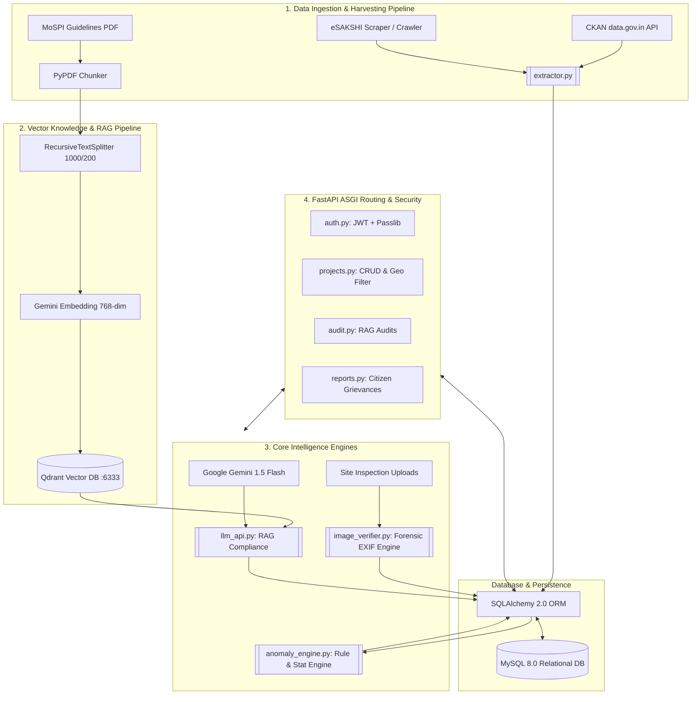

# MPLAD Rakshak — Backend Architecture, Pipelines & Technologies

This document provides a comprehensive technical overview of the backend processes, data and AI pipelines, algorithmic detection engines, and technology stacks running within the **MPLAD Rakshak** platform.

---

## 1. High-Level Architecture Flow



---

## 2. Technology Stack & Frameworks

| Domain | Technology / Library | Purpose & Implementation |
| :--- | :--- | :--- |
| **API Framework** | **FastAPI (0.110+)** | High-performance asynchronous ASGI web framework using Pydantic v2 for request/response serialization, strict typing, and automated OpenAPI documentation. |
| **ASGI Server** | **Uvicorn** | Asynchronous server worker running event loops supporting concurrent non-blocking I/O. |
| **Relational Database** | **MySQL 8.0** | ACID-compliant relational storage for structured entities (Users, Projects, Contractors, Awards, Inspection Photos, and Anomaly Alerts). |
| **ORM & Persistence** | **SQLAlchemy 2.0** | Declarative Base mapping with connection pooling (`pool_pre_ping=True`), relationship cascades, and typed queries. |
| **DB Driver** | **PyMySQL + Cryptography** | Pure-Python MySQL client supporting `caching_sha2_password` authentication protocol. |
| **Vector Database** | **Qdrant (Port 6333)** | Vector similarity search engine hosting statutory MoSPI guidelines indexed with 768-dimensional Cosine Distance. |
| **Generative AI & LLM** | **Google Gemini 1.5 Flash** | AI compliance evaluator analyzing project descriptions and tender Bill of Quantities (BOQ) against statutory guidelines. |
| **Document Processing** | **PyPDF2 + LangChain** | Chunks raw MoSPI statutory PDF guidelines using `RecursiveCharacterTextSplitter` (chunk size: 1000, overlap: 200). |
| **Computer Vision & Forensics** | **Pillow, ExifRead, OpenCV, NumPy** | EXIF binary metadata extraction, GPS decimal coordinate conversion, software tampering signature checks, and image integrity verification. |
| **Security & Auth** | **python-jose + passlib (bcrypt)** | Stateless JWT authorization with salted BCrypt password hashing and fine-grained Role-Based Access Control (RBAC). |
| **Data Harvesting** | **Requests, Urllib3** | Scheduled and on-demand polling of external government portals (`data.gov.in`, eSAKSHI). |

---

## 3. Core Pipelines

### Pipeline A: Data Ingestion & Harvesting Pipeline
- **File Reference**: [`backend/services/extractor.py`](file:///c:/Users/Ashutosh/OneDrive/Desktop/MPLAD%20Rakshak/backend/services/extractor.py), [`backend/main.py`](file:///c:/Users/Ashutosh/OneDrive/Desktop/MPLAD%20Rakshak/backend/main.py)
1. **CKAN Open Government Data Harvester**:
   - Queries `data.gov.in` API endpoints using official project resource IDs.
   - Ingests sanctioned works, district identifiers, allocated funds, and cumulative expenditure.
2. **eSAKSHI Crawler**:
   - Scrapes eSAKSHI web services to track real-time project sanction status, installment releases, and Utilization Certificates (UC).
3. **Resilient Fallback Generator**:
   - Generates realistic synthetic Indian constituency records (e.g., Varanasi, Wayanad, New Delhi) if external government portal APIs rate-limit or fail, ensuring zero downtime.
4. **Automated Seeding & DB Initialization**:
   - On application startup (`lifespan` hook), checks if the relational database contains active records; if empty, automatically seeds projects, registered contractors, site inspections, and sample alerts.

---

### Pipeline B: MoSPI Statutory Guidelines Vector RAG Pipeline
- **File Reference**: [`backend/services/llm_api.py`](file:///c:/Users/Ashutosh/OneDrive/Desktop/MPLAD%20Rakshak/backend/services/llm_api.py)

```
[MoSPI Guidelines PDF] 
   ➔ [PyPDF Extraction] 
   ➔ [Recursive Character Chunking (1000/200)] 
   ➔ [Gemini 768-dim Embedding Vectorization] 
   ➔ [Qdrant Payload Indexing ("mplad_guidelines_2023")]
```

1. **Document Ingestion**:
   - Reads the revised **MoSPI MPLADS 2023 Guidelines** directly from storage.
2. **Semantic Chunking**:
   - Splits text into contextual windows of 1,000 characters with 200-character overlaps to prevent boundary-clause truncation.
3. **Vector Embedding & Storage**:
   - Creates a collection in Qdrant named `mplad_guidelines_2023` configured with **768-dimensional Cosine Distance**.
4. **Retrieval-Augmented Generation (RAG) Compliance Audit**:
   - When a project proposal is audited, its title, category, description, and budget are converted into query embeddings.
   - Top-$k$ closest statutory clauses are retrieved from Qdrant.
   - A structured prompt is sent to **Google Gemini Flash**, which evaluates:
     - **Permissibility**: Flags prohibited works (e.g., religious structures, private properties, boundary walls of non-aided bodies).
     - **Cost Ceiling Feasibility**: Flags deviations from the state Schedule of Rates (SoR).
     - **Exact Clause Citation**: Returns structured JSON with statutory chapter and clause references.

---

### Pipeline C: Statistical & Geospatial Anomaly Detection Engine
- **File Reference**: [`backend/services/anomaly_engine.py`](file:///c:/Users/Ashutosh/OneDrive/Desktop/MPLAD%20Rakshak/backend/services/anomaly_engine.py)

Runs automated algorithmic auditing without requiring human intervention:

#### 1. SC / ST Quota Allocation Audit (Statutory Clause 2.3)
- **Rule**: MPs must allocate at least **15%** of MPLADS funds to Scheduled Caste (SC) inhabited areas and **7.5%** to Scheduled Tribe (ST) areas annually.
* **Mathematical Compliance Check**:
  \(\text{SC Expenditure Ratio} = \frac{\sum \text{Expenditure}_{\text{SC}}}{\text{Total Expenditure}}\)

  \(\text{ST Expenditure Ratio} = \frac{\sum \text{Expenditure}_{\text{ST}}}{\text{Total Expenditure}}\)

  The calculated ratios are compared against the **applicable statutory/policy allocation thresholds** for SC and ST expenditure. A compliance exception is raised when the observed ratio falls below the applicable threshold, subject to the relevant scheme rules and data period.

* Generates **HIGH-severity compliance alerts** when a verified shortfall is detected against the applicable threshold.


#### 2. Cartelization & Contractor Monopoly Analysis
- **Monopoly Check**: Computes market share of awarded contracts per constituency. If a single contractor captures $> 30\%$ of total awarded value, a cartelization warning is raised.
- **Tender Splitting / Evasion Detection**:
  - Detects instances where larger works are split into multiple smaller projects valued just under **₹5,00,000** (e-tendering mandatory threshold) within a **5 km radius** within 90 days.

#### 3. Geospatial Proximity & Duplicate Asset Detection
- Uses the **Haversine Great-Circle Distance Formula**:
  $$d = 2r \arcsin\left(\sqrt{\sin^2\left(\frac{\Delta \phi}{2}\right) + \cos(\phi_1)\cos(\phi_2)\sin^2\left(\frac{\Delta \lambda}{2}\right)}\right)$$
- If a newly proposed asset is within **50 meters** of an existing project in the same category (e.g., installing a community hall or borewell right next to an existing one), it flags a duplicate spending alert.

#### 4. SLA & Administrative Delay Risk Detector
- Tracks time elapsed between MP recommendation and District Authority administrative sanction.
- Flags projects exceeding the **45-day statutory SLA** (Clause 4.2 breach).

---

### Pipeline D: Computer Vision & Forensic Image Verification Pipeline
- **File Reference**: [`backend/services/image_verifier.py`](file:///c:/Users/Ashutosh/OneDrive/Desktop/MPLAD%20Rakshak/backend/services/image_verifier.py)

```
[Raw Photo File]
   ├──> [EXIF Binary Stream Analysis] 
   │       ├──> Extract Camera Maker & Model
   │       └──> Parse Software Editing Tags (Photoshop, Canva, GIMP)
   ├──> [GPS EXIF Extraction (DMS to Decimal)]
   │       └──> Haversine Distance vs. Sanctioned Project Centroid (Tolerance: 500m)
   └──> [Temporal Consistency Check]
           └──> Compare EXIF Creation Timestamp vs. Server Upload Time
```

1. **Tamper & Software Signature Detection**:
   - Inspects EXIF `0x0131 (Software)` and `ImageDescription` tags.
   - Flags suspicious editing software signatures like `"Photoshop"`, `"Canva"`, `"GIMP"`, or `"Pixlr"`.
2. **Geotag Displacement Calculation**:
   - Converts GPS coordinates from Degrees-Minutes-Seconds (DMS) rational tuples to decimal coordinates:
     $$\text{Decimal} = \text{Deg} + \frac{\text{Min}}{60} + \frac{\text{Sec}}{3600}$$
   - Calculates radial displacement from the project's officially sanctioned latitude/longitude. If distance $> 500\text{m}$, marks `gps_matched = False` and triggers an anomaly.
3. **Temporal Verification**:
   - Verifies the EXIF `DateTimeOriginal` against the upload timestamp to prevent re-submitting historical or archive images.

---

### Pipeline E: Citizen Grievance & Multi-Report Deduplication Pipeline
- **File Reference**: [`backend/routers/reports.py`](file:///c:/Users/Ashutosh/OneDrive/Desktop/MPLAD%20Rakshak/backend/routers/reports.py)

1. **Submission**: Citizens submit ground feedback or evidence against a specific `project_id`.
2. **Aggregation & Deduplication**:
   - Checks if an active anomaly or grievance already exists for that project.
   - If multiple citizens flag the same issue (e.g. "Work not started but funds cleared"):
     - Increments the report weight/tally.
     - Escalates severity from `MEDIUM` $\rightarrow$ `HIGH` $\rightarrow$ `CRITICAL`.
3. **Dispatch & Workflow**:
   - Dispatches real-time alerts to the **District Authority** dashboard for field verification.
   - Enables District Authorities and Ministry Admins to update status (`PENDING` $\rightarrow$ `INVESTIGATING` $\rightarrow$ `RESOLVED`).

---

### Pipeline F: Security, RBAC & API Router Layer
- **File Reference**: [`backend/routers/auth.py`](file:///c:/Users/Ashutosh/OneDrive/Desktop/MPLAD%20Rakshak/backend/routers/auth.py)

- **Role-Based Access Control (RBAC)** across 5 distinct actors:
  1. `citizen`: Public transparency portal, map exploration, grievance reporting.
  2. `contractor`: Work order views, camera-only photo uploads with instant EXIF validation.
  3. `district_authority`: Sanction management, inspection audits, field officer dispatch.
  4. `mp` (Member of Parliament): Constituency expenditure tracking, quota metrics.
  5. `ministry_admin`: National oversight, contractor blacklisting, cross-state quota analytics.
- **JWT Authentication**:
  - Issues signed tokens with `sub`, `role`, and `exp` claims.
  - Protected endpoints utilize FastAPI `Depends(get_current_user)` enforcing strict role guards.

---

## 4. Backend Codebase Directory Structure

```
backend/
├── main.py                     # App entry point, CORS, startup lifespan, Qdrant/DB health
├── config.py                   # Environment & credential configuration
├── database.py                 # SQLAlchemy engine, session maker, base model
├── models.py                   # 6 ORM Models (User, Project, Contractor, etc.)
├── requirements.txt            # Python dependencies
├── routers/
│   ├── auth.py                 # Login, signup, password hashing, JWT generation
│   ├── projects.py             # Projects CRUD, geo-bounding, category filters
│   ├── audit.py                # RAG AI compliance triggers, manual audit workflow
│   └── reports.py              # Anomaly alerts & citizen grievance lifecycle
└── services/
    ├── extractor.py            # CKAN data.gov.in & eSAKSHI data harvester
    ├── llm_api.py              # Gemini 1.5 RAG + Qdrant guideline retrieval
    ├── anomaly_engine.py       # SC/ST quotas, cartelization, delay & collision checks
    └── image_verifier.py       # EXIF geotagging, tampering & software tag detection
```
