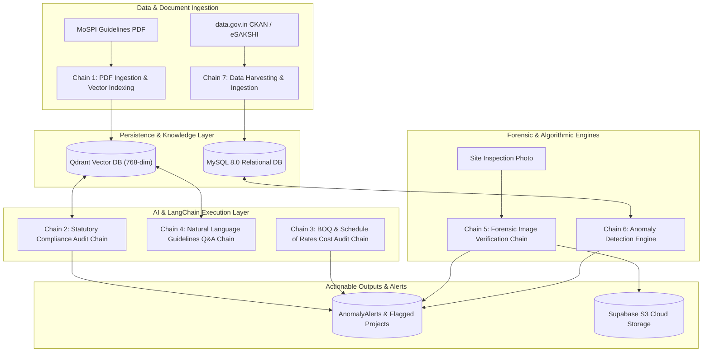
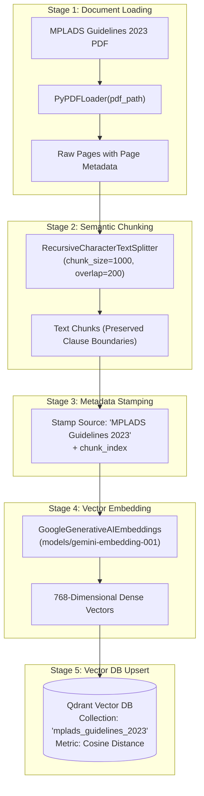
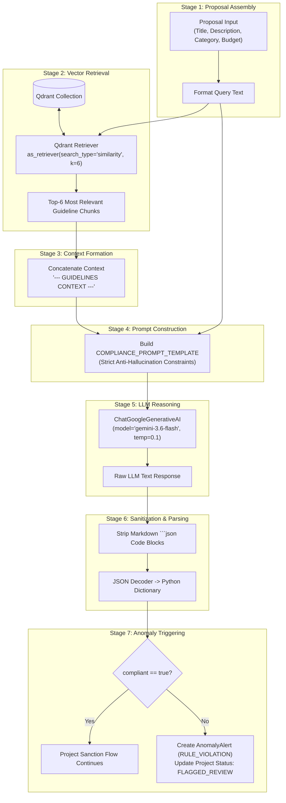
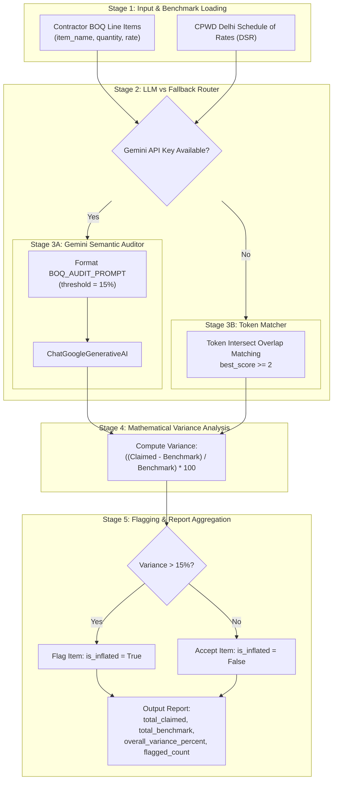
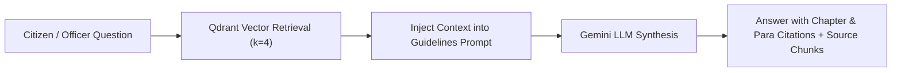
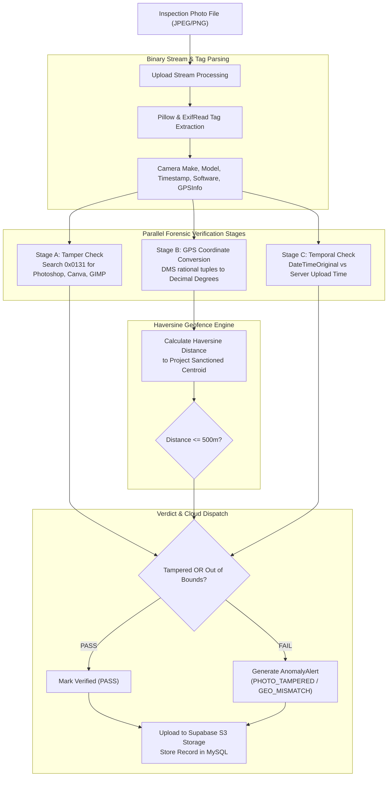
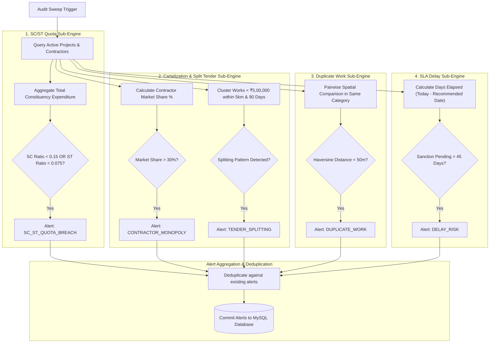
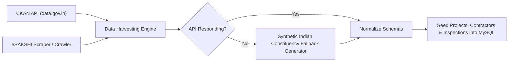

# 🔗 MPLAD Rakshak — Chains & Processing Pipelines Architecture

This document provides a comprehensive technical breakdown of all **LangChain / LLM Reasoning Chains** and **Forensic / Algorithmic Processing Pipelines** implemented in **MPLAD Rakshak**, including detailed stage-by-stage descriptions and Mermaid visual flow diagrams.

---

## 📑 Table of Contents
1. [Master Architecture Overview](#master-architecture-overview)
2. [AI & LangChain RAG Chains](#1-ai--langchain-rag-chains)
   - [Chain 1: Guidelines Document Ingestion & Vector Indexing Chain](#chain-1-guidelines-document-ingestion--vector-indexing-chain)
   - [Chain 2: Statutory Compliance Audit RAG Chain](#chain-2-statutory-compliance-audit-rag-chain)
   - [Chain 3: BOQ & Schedule of Rates (SoR) Cost Audit Chain](#chain-3-boq--schedule-of-rates-sor-cost-audit-chain)
   - [Chain 4: Natural Language Guidelines Q&A RAG Chain](#chain-4-natural-language-guidelines-qa-rag-chain)
3. [Forensic & Algorithmic Detection Chains](#2-forensic--algorithmic-detection-chains)
   - [Chain 5: Computer Vision & Forensic Image Verification Chain](#chain-5-computer-vision--forensic-image-verification-chain)
   - [Chain 6: Statistical & Geospatial Anomaly Detection Engine](#chain-6-statistical--geospatial-anomaly-detection-engine)
   - [Chain 7: Data Harvesting & Seed Ingestion Pipeline](#chain-7-data-harvesting--seed-ingestion-pipeline)
4. [Summary Comparison Matrix](#3-summary-comparison-matrix)

---

## Master Architecture Overview

---

## 1. AI & LangChain RAG Chains

### Chain 1: Guidelines Document Ingestion & Vector Indexing Chain
* **Source Reference:** [`backend/services/llm_api.py`](file:///c:/Users/Ashutosh/OneDrive/Desktop/MPLAD%20Rakshak/backend/services/llm_api.py#L213-L298) (`ingest_guidelines`, `_seed_guidelines_text`)
* **Core Libraries:** `langchain_community.document_loaders.PyPDFLoader`, `langchain.text_splitter.RecursiveCharacterTextSplitter`, `langchain_google_genai.GoogleGenerativeAIEmbeddings`, `langchain_qdrant.QdrantVectorStore`

#### Visual Flow Diagram

#### Detailed Stages:
1. **Stage 1 (Document Loading):** `PyPDFLoader` opens the official MoSPI MPLADS statutory PDF document and parses each page into memory.
2. **Stage 2 (Context-Preserving Chunking):** Chunks are segmented into 1,000-character windows with a 200-character sliding overlap using `["\n\n", "\n", ". ", " ", ""]` delimiters, preventing clauses from being truncated mid-sentence.
3. **Stage 3 (Metadata Enrichment):** Injects source tags and positional chunk indices into `chunk.metadata`.
4. **Stage 4 (Gemini Vectorization):** Each text segment is converted into a 768-dimensional semantic embedding via Google Gemini Embedding API.
5. **Stage 5 (Qdrant Cloud Persistence):** The vectors and associated payload are upserted into Qdrant vector database under collection `mplads_guidelines_2023`.

---

### Chain 2: Statutory Compliance Audit RAG Chain
* **Source Reference:** [`backend/services/llm_api.py`](file:///c:/Users/Ashutosh/OneDrive/Desktop/MPLAD%20Rakshak/backend/services/llm_api.py#L334-L404) (`check_guideline_compliance`), [`backend/routers/projects.py`](file:///c:/Users/Ashutosh/OneDrive/Desktop/MPLAD%20Rakshak/backend/routers/projects.py#L169-L194)
* **Trigger:** Triggered automatically upon proposal submission (`POST /api/v1/projects/submit`) or on-demand compliance audit (`POST /api/v1/projects/compliance-check`).
* **Core Libraries:** `langchain-qdrant`, `langchain-google-genai.ChatGoogleGenerativeAI`, `Pydantic v2`

#### Visual Flow Diagram

#### Detailed Stages:
1. **Stage 1 (Proposal Ingestion & Assembly):** Aggregates proposal attributes (title, sector category, description, and requested funds) into a structured assessment text.
2. **Stage 2 (Semantic Vector Retrieval):** Invokes Qdrant similarity search ($k=6$) to fetch statutory clauses matching the nature of the project.
3. **Stage 3 (Context Assembly):** Assembles retrieved guideline clauses into an isolated, delimited context string.
4. **Stage 4 (Constrained Prompt Synthesis):** Employs strict system instructions forbidding hallucination and enforcing exact clause references (e.g. Chapter 2 Para 2.1).
5. **Stage 5 (LLM Inference):** Google Gemini 1.5/3.6 Flash reasons over the proposal against the retrieved statutory excerpts.
6. **Stage 6 (Sanitization & JSON Validation):** Strips markdown fences and parses the output to enforce a schema containing:
   - `compliant` (*boolean*)
   - `violated_clauses` (*list of strings*)
   - `explanation` (*detailed justification*)
   - `confidence_score` (*float between 0.0 and 1.0*)
7. **Stage 7 (Automated Action):** If non-compliant, automatically writes a `RULE_VIOLATION` alert to MySQL and changes project state to `FLAGGED_REVIEW`.

---

### Chain 3: BOQ & Schedule of Rates (SoR) Cost Audit Chain
* **Source Reference:** [`backend/services/llm_api.py`](file:///c:/Users/Ashutosh/OneDrive/Desktop/MPLAD%20Rakshak/backend/services/llm_api.py#L438-L586) (`audit_boq_items`)
* **Data Sources:** CPWD Delhi Schedule of Rates (DSR) [`backend/data/sor/cpwd_dsr_sample.json`](file:///c:/Users/Ashutosh/OneDrive/Desktop/MPLAD%20Rakshak/backend/data/sor/cpwd_dsr_sample.json)

#### Visual Flow Diagram

#### Detailed Stages:
1. **Stage 1 (Benchmark Loading):** Ingests official government standard benchmark rates (CPWD DSR).
2. **Stage 2 (Router Branch):** Routes through Gemini LLM for semantic item alignment or falls back to rule-based token intersection if offline.
3. **Stage 3 (Item Specification Matching):** Matches contractor claimed descriptions (e.g. "Excavation in ordinary soil") with official CPWD specifications.
4. **Stage 4 (Variance Calculation):** Computes financial discrepancy percentages:
   $$\text{Variance \%} = \frac{\text{Claimed Rate} - \text{Benchmark Rate}}{\text{Benchmark Rate}} \times 100$$
5. **Stage 5 (Cost Inflation Flagging):** Flags items exceeding the permissible statutory threshold (15%) and tallies the total financial inflation.

---

### Chain 4: Natural Language Guidelines Q&A RAG Chain
* **Source Reference:** [`backend/services/llm_api.py`](file:///c:/Users/Ashutosh/OneDrive/Desktop/MPLAD%20Rakshak/backend/services/llm_api.py#L592-L658) (`query_guidelines`)
* **Trigger:** `POST /api/v1/projects/query-guidelines`

#### Visual Flow Diagram

#### Detailed Stages:
1. **Stage 1 (Query Ingestion):** Ingests free-form citizen or administrative questions regarding scheme entitlements and restrictions.
2. **Stage 2 (Vector Retrieval):** Fetches the top-4 most semantically relevant guideline sections from Qdrant.
3. **Stage 3 (Grounding Formulation):** Injects the retrieved clauses into a structured prompt explicitly commanding grounding in the provided context.
4. **Stage 4 (Synthesis):** Gemini generates an authoritative answer citing specific chapter and section numbers.
5. **Stage 5 (Response Packaging):** Returns the synthesized answer, verbatim source chunks, and confidence metric.

---

## 2. Forensic & Algorithmic Detection Chains

### Chain 5: Computer Vision & Forensic Image Verification Chain
* **Source Reference:** [`backend/services/image_verifier.py`](file:///c:/Users/Ashutosh/OneDrive/Desktop/MPLAD%20Rakshak/backend/services/image_verifier.py), [`backend/routers/projects.py`](file:///c:/Users/Ashutosh/OneDrive/Desktop/MPLAD%20Rakshak/backend/routers/projects.py#L198-L296)
* **Trigger:** Milestone physical photo upload (`POST /api/v1/projects/{project_id}/upload-photo`)

#### Visual Flow Diagram

#### Detailed Stages:
1. **Stage 1 (Image Stream Extraction):** Extracts EXIF metadata directly from binary image headers via `Pillow` and `ExifRead`.
2. **Stage 2 (Software Signature Tampering Detection):** Checks `0x0131 (Software)` tags against known photo manipulation tools (`Photoshop`, `Canva`, `GIMP`, `Lightroom`, `Pixlr`, etc.).
3. **Stage 3 (GPS Coordinate Conversion):** Converts raw Degrees-Minutes-Seconds (DMS) rational tuples to decimal coordinates:
   $$\text{Decimal} = \text{Degrees} + \frac{\text{Minutes}}{60} + \frac{\text{Seconds}}{3600}$$
4. **Stage 4 (Haversine Proximity Check):** Evaluates distance against project coordinates using the Great-Circle Haversine formula:
   $$d = 2r \arcsin\left(\sqrt{\sin^2\left(\frac{\Delta \phi}{2}\right) + \cos(\phi_1)\cos(\phi_2)\sin^2\left(\frac{\Delta \lambda}{2}\right)}\right)$$
   Flags an anomaly if distance exceeds the **500m tolerance**.
5. **Stage 5 (Temporal Validation):** Compares internal camera capture timestamp with the server receipt time to prevent re-submission of older archive images.
6. **Stage 6 (Cloud Storage & Anomaly Dispatch):** Stores image in **Supabase S3 Cloud Storage** (`inspection-photos`), saves EXIF audit records, and raises alerts on verification failure.

---

### Chain 6: Statistical & Geospatial Anomaly Detection Engine
* **Source Reference:** [`backend/services/anomaly_engine.py`](file:///c:/Users/Ashutosh/OneDrive/Desktop/MPLAD%20Rakshak/backend/services/anomaly_engine.py#L427-L491) (`run_all_anomaly_checks`)
* **Trigger:** Scheduled cron jobs, startup lifecycle, or on-demand audit trigger (`POST /api/v1/audit/run-sweep`).

#### Visual Flow Diagram

#### Detailed Stages:
1. **Stage 1 (SC/ST Quota Compliance):** Computes expenditure fractions per district and checks statutory minimums (15% for SC, 7.5% for ST).
2. **Stage 2 (Contractor Monopoly Analysis):** Identifies contractors controlling $>30\%$ of total sanctioned project funds within a single district.
3. **Stage 3 (Tender Splitting Evasion):** Identifies works broken down just below the **₹5,00,000 mandatory e-tendering threshold** within a 5 km radius.
4. **Stage 4 (Geospatial Duplicate Work Detection):** Employs Haversine calculation to detect overlapping projects within **50 meters** in identical categories.
5. **Stage 5 (45-Day Statutory SLA Delay Detector):** Identifies proposals un-sanctioned after the 45-day statutory deadline (Para 3.1 breach).
6. **Stage 6 (Deduplication & Persistence):** Aggregates findings, prevents duplicate alert entries, and commits them to MySQL with severity rankings (`CRITICAL`, `HIGH`, `MEDIUM`).

---

### Chain 7: Data Harvesting & Seed Ingestion Pipeline
* **Source Reference:** [`backend/services/extractor.py`](file:///c:/Users/Ashutosh/OneDrive/Desktop/MPLAD%20Rakshak/backend/services/extractor.py), [`backend/main.py`](file:///c:/Users/Ashutosh/OneDrive/Desktop/MPLAD%20Rakshak/backend/main.py#L50-L58)

#### Visual Flow Diagram

#### Detailed Stages:
1. **Stage 1 (CKAN Ingestion):** Queries official `data.gov.in` endpoints for sanctioned project funds and district allocations.
2. **Stage 2 (eSAKSHI Web Scraping):** Scrapes real-time milestone disbursement and Utilization Certificate (UC) releases.
3. **Stage 3 (Resilient Fallback Ingestion):** If external government APIs rate-limit or fail, synthetic generation maintains operational zero-downtime test environments.
4. **Stage 4 (Database Seeding):** Normalizes project records and seeds the MySQL database on startup.

---

## 3. Summary Comparison Matrix

| Chain Name | Type | Input Artifact | Core Engines / Libraries | Primary Output | Trigger Mechanism |
| :--- | :--- | :--- | :--- | :--- | :--- |
| **Guidelines Vector Ingestion** | AI / RAG | MoSPI 2023 Guidelines PDF | `PyPDFLoader`, `RecursiveCharacterTextSplitter`, `GoogleGenerativeAIEmbeddings`, `Qdrant` | 768-dim Qdrant Vector Collection | Server Startup / Admin Seed |
| **Statutory Compliance Audit** | AI / RAG | Proposal Details (Title, Description, Budget) | `QdrantVectorStore`, `ChatGoogleGenerativeAI` (`gemini-3.6-flash`) | Structured JSON Compliance Assessment | `POST /submit` or Manual Audit |
| **BOQ Cost Benchmark Audit** | AI / Statistical | Line-item BOQ & CPWD Schedule of Rates | `ChatGoogleGenerativeAI`, JSON Parser, Fuzzy Word Intersect | Item Variance % & Inflation Flags | Contractor Tender Verification |
| **Guidelines Natural Q&A** | AI / RAG | Natural Language Text Query | `QdrantVectorStore`, `ChatGoogleGenerativeAI` | Chapter/Clause Cited Answers | `POST /query-guidelines` |
| **Forensic Image Verification** | Forensic / Vision | Site JPEG/PNG Inspection Photo | `Pillow`, `ExifRead`, Haversine Distance Formula, `Supabase S3` | PASS/FAIL Verdict + Cloud Image URL | Photo Upload Endpoint |
| **Anomaly Detection Sweep** | Statistical / GIS | Active Project Database Rows | Haversine Formula, Aggregation Math, `SQLAlchemy` | Deduplicated `AnomalyAlert` Database Rows | Lifespan, Cron, or `/run-sweep` |
| **Data Harvesting Pipeline** | Data Ingestion | Government APIs (`data.gov.in`, eSAKSHI) | `Requests`, `Urllib3`, Fallback Generator | Normalized Relational Project Tables | Database Seeding Hook |
