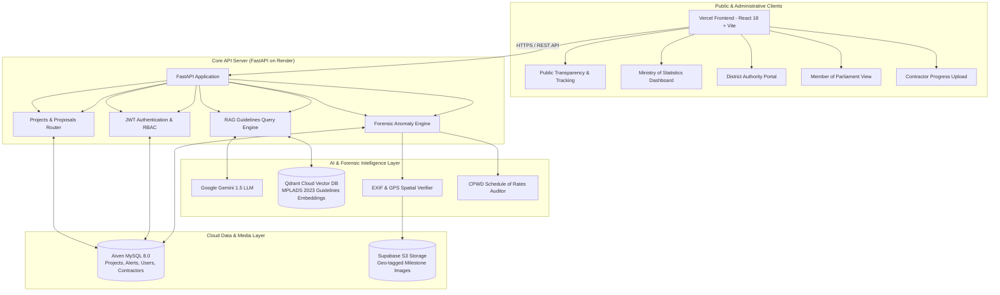

# 🛡️ MPLAD Rakshak

**AI-Powered Monitoring, Compliance Audit & Anomaly Detection Platform for MPLADS**

[](https://mplad-rakshak.vercel.app/)
[](https://mplad-rakshak.onrender.com/docs)

[](https://www.sih.gov.in/)
[-blue.svg)](https://www.sih.gov.in/)
[](https://mplad-rakshak.onrender.com)
[](https://mplad-rakshak.vercel.app/)
[](https://aiven.io)
[](https://supabase.com)
[](https://qdrant.tech)

> 🚀 **Live Production Demo:** [https://mplad-rakshak.vercel.app/](https://mplad-rakshak.vercel.app/)  
> ⚡ **Interactive API Swagger Docs:** [https://mplad-rakshak.onrender.com/docs](https://mplad-rakshak.onrender.com/docs)

[](https://youtu.be/lezeW8JsqlA)

---

## 🎥 Project Demo Video

Watch the project walkthrough and feature overview here:  
[YouTube Demo Video](https://youtu.be/lezeW8JsqlA)

---

## Project Report
[View/Download Project Report]
(./MPLADS_Rakshak_Report.pdf)

## 🏛️ Smart India Hackathon (SIH 2026) Overview

* **Problem Statement ID:** `PS ID 26102`
* **Title:** AI-Powered System to Detect Anomalies, Fraud, and Inefficiencies in the Implementation of Member of Parliament Local Area Development Scheme (MPLADS)
* **Organization / Ministry:** Ministry of Statistics and Programme Implementation (MoSPI)
* **Category:** Software
* **Domain Bucket:** Smart Governance & Public Administration
* **Team Name:** **The-LOLgorithms**
* **Institution:** Faculty of Engineering & Technology (FoET), University of Lucknow

### 🎯 Problem Context & Objective
The Member of Parliament Local Area Development Scheme (MPLADS) enables MPs to recommend developmental works in their constituencies with an annual entitlement of **₹5 Crore**. However, tracking thousands of projects across 543+ constituencies presents severe operational hurdles:
1. **Compliance Bottlenecks:** Manual evaluation of proposals against the 100+ page official *MPLADS Guidelines 2023*.
2. **Fraud & Leakages:** Duplicate asset claims, ghost projects, split tenders to evade e-tendering limits, and contractor cartelization.
3. **Delayed Sanctions:** Breaches of the statutory **45-day sanction deadline** by District Authorities.
4. **Quota Deficits:** Unmonitored slippages in the mandatory reservation of **15% for Scheduled Caste (SC)** and **7.5% for Scheduled Tribe (ST)** inhabited areas.
5. **Physical Site Verification Gaps:** Lack of automated forensic inspection of milestone photos (tampering, metadata stripping, GPS spoofing).

**MPLAD Rakshak** solves these challenges by combining **Retrieval-Augmented Generation (RAG)**, **computational spatial geometry (Haversine)**, **EXIF forensic image verification**, and **automated CPWD Schedule of Rates (SoR) auditing**.

---

## 🌐 Live Cloud Deployments & Endpoints

| Component | Provider / Infrastructure | Live Link / Status |
|---|---|---|
| **Frontend Web Portal (Live Demo)** | **Vercel** (Global CDN Edge Network) | [**`https://mplad-rakshak.vercel.app/`**](https://mplad-rakshak.vercel.app/) |
| **Backend API Engine** | **Render Cloud** (Docker Container) | [`https://mplad-rakshak.onrender.com`](https://mplad-rakshak.onrender.com) |
| **Interactive API Docs** | FastAPI Swagger UI | [`https://mplad-rakshak.onrender.com/docs`](https://mplad-rakshak.onrender.com/docs) |
| **Relational Database** | **Aiven MySQL 8.0 Cloud** (SSL Encrypted) | Connected (`mplad_rakshak`) |
| **Vector Database (RAG)** | **Qdrant Cloud** (Managed Cluster AWS us-east-1) | Connected (`mplads_guidelines_2023`) |
| **Cloud Object Storage** | **Supabase Cloud Storage** (S3-compatible) | Bucket: `inspection-photos` |
| **Uptime / Keep-Alive** | **UptimeRobot** (Health Monitor) | 24/7 Warm (`/health`) |

---

## 🏗️ System Architecture



---

## ☁️ Cloud Infrastructure & Tech Stack

### 1. Hosting & Deployment
* **Frontend:** **Vercel** — Automated continuous deployment from the GitHub `main` branch with instant CDN edge caching and SSL. Reverse-proxies `/api/*` requests to the backend.
* **Backend:** **Render** — Containerized deployment of the FastAPI application (`python:3.11-slim`), auto-reloading on commit.
* **Keep-Alive:** **UptimeRobot** — Automated health pings every 10 minutes to `/health` to maintain 0-second cold starts.

### 2. Cloud Databases & Storage
* **Relational Database:** **Aiven Cloud MySQL 8.0**
  * Fully managed, automated TLS/SSL encryption.
  * Stores normalized tables: `users`, `projects`, `contractors`, `anomaly_alerts`, `expenditure_records`, `inspections`.
* **Vector Database:** **Qdrant Cloud**
  * Managed vector engine hosted on AWS US-East.
  * Stores chunked vector embeddings of the 100+ page official *MPLADS Guidelines 2023*.
* **Object / Blob Storage:** **Supabase Cloud Storage**
  * S3-compatible cloud bucket (`inspection-photos`) storing physical site photos uploaded by contractors and district engineers.
  * Direct public CDN URLs with cryptographic hashes for audit trails.

### 3. AI & Analytics
* **LLM:** **Google Gemini 1.5** via LangChain and Google Generative AI SDK for RAG semantic search, justification synthesis, and statutory clause citations.
* **Computer Vision / Forensic:** **Pillow, ExifRead, OpenCV** for metadata integrity, camera hardware consistency, and reverse geo-coordinate distance validation.

---

## ✨ Core Features & Innovations

| Feature | Technical Implementation | Impact |
|---|---|---|
| 🤖 **RAG Statutory Compliance** | LangChain + Gemini 1.5 + Qdrant Cloud | Validates proposals against MPLADS 2023 Guidelines in <2s, citing specific clauses (e.g., Clause 5.2 prohibited list). |
| 🚨 **Spatial Duplicate Asset Detection** | Haversine Formula (GPS Proximity) | Flags duplicate or overlapping construction proposals within 100m of an existing asset. |
| 🕵️‍♂️ **Cartelization & Split-Tender Alerts** | Benford's Law & Graph Pattern Matching | Detects tender splitting right below statutory thresholds (e.g., multiple ₹49.5 Lakh proposals to bypass state e-tendering). |
| ⚖️ **SC/ST Quota Compliance Tracker** | Dynamic Aggregation Engine | Automatically alerts authorities if constituency allocations fall below 15% (SC) or 7.5% (ST). |
| ⏳ **45-Day Statutory Clock** | Temporal Countdown Engine | Tracks proposals awaiting District Authority sanction to eliminate administrative delays. |
| 📸 **Site Photo Forensic Audit** | EXIF Extraction + Geo-fencing | Verifies physical site coordinates against sanctioned GPS within 500m; detects timestamp spoofing. |
| 💰 **CPWD Cost Benchmark Audit** | Rate Variance Engine | Compares Bill of Quantities (BOQ) with CPWD Schedule of Rates (SoR) to flag cost inflation. |
| 🌐 **Multilingual Public Portal** | i18next (English & Hindi) | Citizen transparency portal for real-time tracking of constituency funds and anonymous fraud reporting. |

---

## 👥 Developers & Engineering Team

**Team The-LOLgorithms** — Department of Computer Science & Engineering, University of Lucknow (FoET)

| Member | Role / Focus | GitHub Profile |
|---|---|---|
| **Ashutosh Singh** | Team Leader • Full-Stack & System Architecture | [@ashutoshsingh8](https://github.com/ashutoshsingh8) |
| **Ayush Arya** | Backend Engineering & Cloud Infrastructure | [@Ayush-Arya06](https://github.com/Ayush-Arya06) |
| **Amartya Singh** | AI / RAG Pipeline & Prompt Engineering | [@amartyasingh2769](https://github.com/amartyasingh2769) |
| **Md. Saklain Khan** | Machine Learning & Anomaly Algorithms | [@saklain-uxt](https://github.com/saklain-uxt) |
| **Akarsh Gupta** | Frontend Engineering & GIS Leaflet Maps | [@Akarshxai](https://github.com/Akarshxai) |
| **Alisha Rahman** | UI/UX Design, Research & Testing | [@Alisha-Rahman](https://github.com/Alisha-Rahman) |

---

## 🚀 Local Development Setup

### Prerequisites
- Python 3.11+
- Node.js 18+
- Docker & Docker Compose *(optional)*
- MySQL 8.0 *(or Aiven Cloud credentials)*

### 1. Clone the Repository
```bash
git clone https://github.com/ashutoshsingh8/MPLAD_Rakshak.git
cd MPLAD_Rakshak
```

### 2. Backend Setup
```bash
cd backend
python -m venv venv
# Windows:
venv\Scripts\activate
# Linux/macOS:
source venv/bin/activate

pip install -r requirements.txt
cp ../.env.example .env
# Fill in your MYSQL_URL, GEMINI_API_KEY, QDRANT credentials, and SUPABASE keys in .env

# Run FastAPI dev server:
uvicorn main:app --reload --host 0.0.0.0 --port 8000
```

### 3. Frontend Setup
```bash
cd ../frontend
npm install
npm run dev
```
Open [http://localhost:5173](http://localhost:5173) in your browser.

---

## 🔑 Demo Login Credentials

For testing and jury evaluation, use the following pre-configured department accounts:

| Department / Role | Username | Password | Access Scope |
|---|---|---|---|
| **Ministry Admin (MoSPI)** | `ministry_admin` | `admin123` | National oversight, all constituencies, national anomaly heatmaps |
| **District Authority (DM)** | `da_pune` | `admin123` | Sanction proposals, 45-day clock, local inspections, contractor assignment |
| **Member of Parliament (MP)** | `mp_pune` | `admin123` | Recommend new works, track fund utilization (₹5 Cr), view SC/ST quota |
| **Contractor / Agency** | `contractor_abc` | `admin123` | Submit milestone bills, upload geo-tagged physical progress photos |

---

## 🏛️ Statutory References & Data Sources
- **[Ministry of Statistics & Programme Implementation (MoSPI)](https://www.mospi.gov.in)**
- **[Official MPLADS Portal](https://mplads.gov.in)**
- **[e-SAKSHI Implementation Engine](https://mplads.mospi.gov.in)**
- **[CPWD Schedule of Rates (SoR)](https://cpwd.gov.in)**
- **[Smart India Hackathon 2026 Portal](https://www.sih.gov.in)**

---

**Built with dedication for Smart India Hackathon 2026 | Team The-LOLgorithms**
