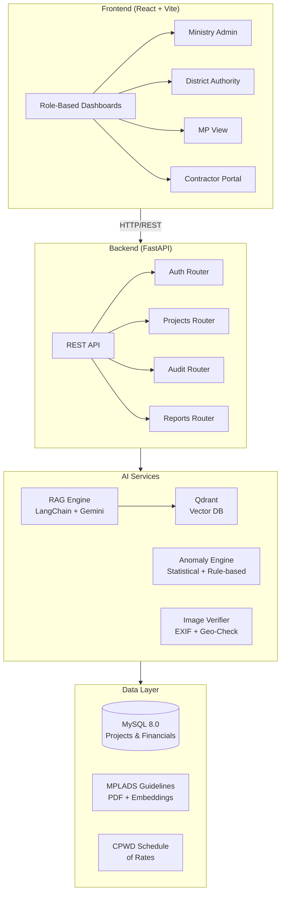

# 🛡️ MPLAD Rakshak

**AI-Powered Monitoring & Anomaly Detection Platform for MPLADS**

> Smart India Hackathon 2026 — Problem Statement 26102

---

## 🏗️ Architecture



## ✨ Features

| Feature | Description |
|---------|-------------|
| 🤖 **RAG-Powered Compliance** | Semantic analysis of proposals against MPLADS 2023 Guidelines using Gemini + Qdrant |
| 🚨 **Fraud Detection** | Cartelization detection, contract splitting, duplicate work alerts via Haversine analysis |
| ⏰ **45-Day Tracker** | Countdown timers for mandatory sanction deadlines per MPLADS guidelines |
| ⚖️ **SC/ST Quota Monitor** | Automatic flagging when districts fall below 15% SC / 7.5% ST allocation |
| 📷 **Photo Verification** | EXIF extraction, GPS proximity check, and tampering detection for site photos |
| 🗺️ **GIS Mapping** | Interactive Leaflet map with risk-coded project markers |
| 💰 **Cost Audit** | BOQ comparison against CPWD Schedule of Rates with inflation flagging |

## 🚀 Quick Start

### Prerequisites
- Docker & Docker Compose
- (Optional) Google Gemini API Key for AI features

### 1. Clone & Configure
```bash
git clone https://github.com/Ashutoshfx/MPLAD_Rakshak.git
cd MPLAD_Rakshak
cp .env.example .env
# Edit .env and add your GEMINI_API_KEY (optional)
```

### 2. Launch with Docker
```bash
docker compose up --build
```

### 3. Access
| Service | URL |
|---------|-----|
| Frontend Dashboard | http://localhost:5173 |
| Backend API Docs | http://localhost:8000/docs |
| Qdrant Dashboard | http://localhost:6333/dashboard |

### 4. Demo Credentials
| Role | Username | Password |
|------|----------|----------|
| Ministry Admin | `ministry_admin` | `admin123` |
| District Authority | `da_pune` | `admin123` |
| MP | `mp_pune` | `admin123` |
| Contractor | `contractor_abc` | `admin123` |

## 📁 Project Structure

```
├── backend/
│   ├── main.py              # FastAPI entry point
│   ├── config.py            # Environment configuration
│   ├── database.py          # SQLAlchemy setup
│   ├── models.py            # 6 database models
│   ├── schemas.py           # Pydantic request/response schemas
│   ├── services/
│   │   ├── extractor.py     # CKAN + web scraping data pipeline
│   │   ├── llm_api.py       # Gemini RAG engine
│   │   ├── anomaly_engine.py # Fraud detection algorithms
│   │   └── image_verifier.py # EXIF + geo verification
│   ├── routers/
│   │   ├── auth.py          # JWT authentication
│   │   ├── projects.py      # CRUD + compliance check
│   │   ├── audit.py         # Anomaly management
│   │   └── reports.py       # Dashboard aggregations
│   └── data/                # Mock data for offline testing
├── frontend/
│   ├── src/
│   │   ├── views/           # 4 role-based dashboards
│   │   ├── components/      # Reusable UI widgets
│   │   └── services/api.js  # Backend API client
│   └── ...
└── docker-compose.yml       # Full stack orchestration
```

## 🧪 API Endpoints

| Method | Endpoint | Description |
|--------|----------|-------------|
| POST | `/api/v1/auth/login` | JWT authentication |
| GET | `/api/v1/projects` | List projects (filtered) |
| POST | `/api/v1/projects/submit` | Submit proposal + auto-compliance |
| POST | `/api/v1/projects/{id}/upload-photo` | Photo + EXIF verification |
| GET | `/api/v1/audit/anomalies` | List anomaly alerts |
| POST | `/api/v1/audit/run-sweep` | Trigger anomaly detection |
| GET | `/api/v1/reports/summary` | Dashboard statistics |
| GET | `/api/v1/health` | System health check |

## 🏛️ MPLADS Guidelines Reference

This system enforces the following key rules from **MPLADS Guidelines 2023**:

- **₹5 Crore** annual entitlement per MP
- **45-day** sanction deadline for District Authorities
- **1-year** completion limit for sanctioned works
- **15% SC / 7.5% ST** mandatory area allocation
- **₹50 Lakh** max outside-constituency expenditure
- Mandatory geo-tagged photo uploads via eSAKSHI

## 🛠️ Tech Stack

| Layer | Technology |
|-------|-----------|
| Frontend | React 18, Vite, TailwindCSS, Leaflet, Chart.js, Lucide |
| Backend | Python 3.11, FastAPI, SQLAlchemy, Pydantic v2 |
| AI/LLM | LangChain, Google Gemini, Qdrant Vector DB |
| Database | MySQL 8.0 |
| Image | Pillow, ExifRead, OpenCV |
| Deploy | Docker Compose |

---

**Built with ❤️ for Smart India Hackathon 2026**
